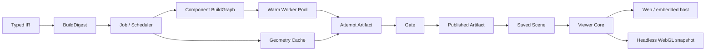

# Build Runtime 与 Viewer 重构

## 完成范围与依赖

对照 `text-to-cad-freecad-refactor-plan.md`，Phase 1 的 Artifact 查询边界是已有基础。本轮在现有未提交实现上补齐 Phase 2–5 的生产接线、并发边界、可复用渲染入口和回归证据。Typed IR 仍是创作源，FreeCAD 只运行在独立进程中。

| 模块 | 前置依赖 | 当前职责 |
| --- | --- | --- |
| Artifact / Gate / Inspector | 隔离 attempt、不可变发布 | 从同一产物读取输入、测量、Scene 和导出；仅 Gate PASS 可发布 |
| BuildDigest / GeometryCache | 确定性输入与后端身份、完整产物 | 跨版本复用几何，重新绑定本次模型和版本；不复用 Gate 结论 |
| Job / Scheduler | attempt 生命周期、几何复用 | 持久状态、合并重复请求、淘汰旧版本、超时、取消和进度 |
| WarmWorkerPool | Job 所有者、可中断 RPC | 有界租约、进程复用、独立取消、崩溃恢复 |
| Assembly BuildGraph | Digest、Cache、Pool、已验证 PartRef | 并行构建完整 Body，然后顺序合并和求解装配 |
| Viewer Core / Hosts / Snapshot | 已保存 Scene 与 artifact_id | 相机、网格、姿态、着色器独立于页面；交互与无界面截图共用 Core |



Viewer 不依赖 Scheduler 或在线 worker；保存的 Scene 是这条链路的切断点。组件节点依赖整个零件文档，单个 Body 内部的 Sketch / Pad / Pocket / Fillet 历史始终顺序执行。

## 身份与缓存

`artifact_id` 绑定 attempt、冻结输入与输出字节，是持久验证证据。`BuildDigest` 绑定规范化几何 IR、编译器/IR 能力文件指纹、FreeCAD 版本、导出格式与外部组件文档哈希。它忽略模型 ID、版本、notes 和 requirements；几何相同的 Undo、重试或复制可以命中缓存。PartRef 的构建身份使用文档字节和源 body_id，产物 attempt ID 仍记录在构建图中作为来源。

Job 的 `input_digest` 包含完整 IR 和 requirements，避免不同验收要求合并成同一任务。`digest` 在获得后端指纹后更新为 BuildDigest。每个 attempt 保存 `build.json` 与 `components.json`，清单对它们做完整性绑定。

| 目录 | 性质与删除后的行为 |
| --- | --- |
| `models/`、事件流、会话 DB、`gate_reports/` | 持久项目状态 |
| `artifact_sets/`、版本发布目录 | 不可变证据及兼容版本索引 |
| `build_jobs/` | 持久 Job 状态；重启后对齐已发布 attempt，其他未完成任务标记 interrupted |
| `document_objects/` | 按实际导出字节 SHA256 寻址的文档对象 |
| `cache/geometry/` | 可删除；下次提交由 IR / 固定引用重新构建 |
| `derived/inspect/` | Scene、mesh、bounds、topology 索引；从保存的产物重建 |
| `derived/snapshots/`、`derived/exports/`、`derived/animations/` | 可删除；从保存的 Scene / FCStd 重建 |

缓存命中会先校验全部缓存文件，重新绑定测量中的 model_id/version，再运行本次 Gate。坏缓存不会向 attempt 写入部分文件。缓存锁按数据根目录与完整 Digest 隔离，避免父构建与子构建因分片碰撞互相等待；等待锁也响应取消。

## 调度、取消与恢复

同一模型、版本与完整输入的并发请求共享任务，取消其中一个等待者不会取消其他等待者。较新版本淘汰旧任务；短暂合并窗口内的中间版本无需启动 FreeCAD。不同模型可以并行，进程并发数由 Pool 限制。

阻塞工作继承 Job 的取消事件和 worker owner。取消会终止该 owner 的租约、缓存等待与组件工作，并等待后台线程退出后再删除 staging。导出和运动检查也使用独立操作 owner。组件失败会及时终止同任务的兄弟组件，构建图按 ID 排序保存。

取消与最终发布共用同步边界：先接受取消则不能替换版本产物；发布已经完成则取消返回 false。发布记录同时保存 artifact_id。失败 attempt 保留独立清单，能通过 ID 查看已有 Scene/测量，不能成为正式版本。重启时恢复已完成但尚未记账的发布，清理对应未完成 staging，不自动重放几何写入。

进度通过 SSE 的 `agent` / `kind=build` 送到页面，也可以使用 `GET /build-jobs`、`GET /build-jobs/{job_id}`、`POST /build-jobs/{job_id}/cancel`。查询历史 Job 不初始化 worker。Viewer 通知失败不改变构建或发布事实。

```yaml
runtime:
  worker_pool_size: 2
  build_debounce_s: 0.05
  build_timeout_s: 600
```

当前调度器面向单个 supervisor 管理一个数据目录；这不是跨多个服务器的分布式队列。Pool 崩溃恢复负责恢复服务能力，不自动重试一个可能部分执行的写入。

## Viewer 与 Snapshot

`tcad/viewer/core/` 包含纯网格/姿态计算、相机、WebGL 与渲染契约。`hosts/web.js` 是独立 artifact viewport，`hosts/snapshot.js` 提供同一 Core 的 artifact 截图。原 `server/ui/viewport.js` 保留为兼容转发入口，页面只负责会话与展示。

Python 和 JS 共用 `render-contract.json` 的相机、fit margin、光照、颜色和边缘阈值。默认 `software` 后端保留无浏览器部署能力；它共用 Scene 与渲染契约，但不保证与 GPU 逐像素一致。选择 `webgl` 后，Agent 和 Web PNG 使用 `render/webgl.py` 加载实际 `MeshViewport` 与 snapshot host，复用交互视图的相机、着色器、样式及姿态代码。该后端仅在本地浏览器中加载打包资源，不访问 Web 服务器、IR Store 或 worker。

```sh
.venv/bin/pip install -e ".[webgl]"
.venv/bin/playwright install chromium
```

```yaml
context:
  render:
    backend: webgl
    # 可选：使用已有 Chrome/Chromium 的绝对路径。
    # browser_executable: /path/to/chrome
```

快照缓存同时绑定代码/契约指纹、后端和参数，不能混用 software 与 WebGL 的旧图片。没有安装浏览器时仍可使用默认 software；显式选择 WebGL 不会静默返回另一个后端的图片。跨 GPU/浏览器版本的像素一致性不是几何验证。

PartRef 固定已验证 artifact_id、body_id 和可选 placement。引用几何由保存的 FCStd 读取，不重新编译引用方的实时源；本地并行 Body 合并后保留可编辑的 PartDesign 特征历史。当前构建图是组件到最终装配的两级图，固定引用不触发递归的实时源构建。

Agent CAD/Assembly contract 已接入生产 system prompt。按需导出、原生装配读取/媒体导出和采样 BRep 干涉检查使用冻结产物；采样清晰不证明连续间隙、接触力或实际切削。

## 验证

2026-10-05 最终检查：`pytest tests/unit tests/contract -q` **1438 passed**，无跳过；`node --test tests/frontend/*.test.mjs` **36 passed**；`git diff --check` 通过。Python 仅报告 Starlette/AnyIO 现有弃用警告。Wheel 构建成功并确认包含 Build Runtime、Viewer Core、snapshot host 和 Agent Contract 资源。

- 单元回归：Digest 身份、损坏缓存、跨版本绑定、锁隔离、重复等待者、快速编辑合并、取消/发布、超时、observer 异常、Job 恢复及独立进程崩溃恢复。
- 真实 FreeCAD：缓存命中仍按新 requirement 失败、组件并行进入 worker、可编辑 FCStd、固定 PartRef、无源转换、原生并行/串行逐帧矩阵一致、删缓存重建与旧产物保留。
- 前端：artifact loader、乱序响应、Host 销毁、姿态与 bounds；保留交互控制和页面回归。
- Chrome 合约：实际 Core 输出非空 PNG；Agent/HTTP 图像一致；后端缓存隔离、删除重建，预览不启动 worker。
- 浏览器手动检查：未启动 worker 的页面能显示真实 FreeCAD 已发布模型及验证状态，标准视角可切换。截图见本地 `output/playwright/viewer-refactor.png`。

真实模型服务 E2E 需要另行提供可用服务和凭据，本轮没有发起付费模型请求。
