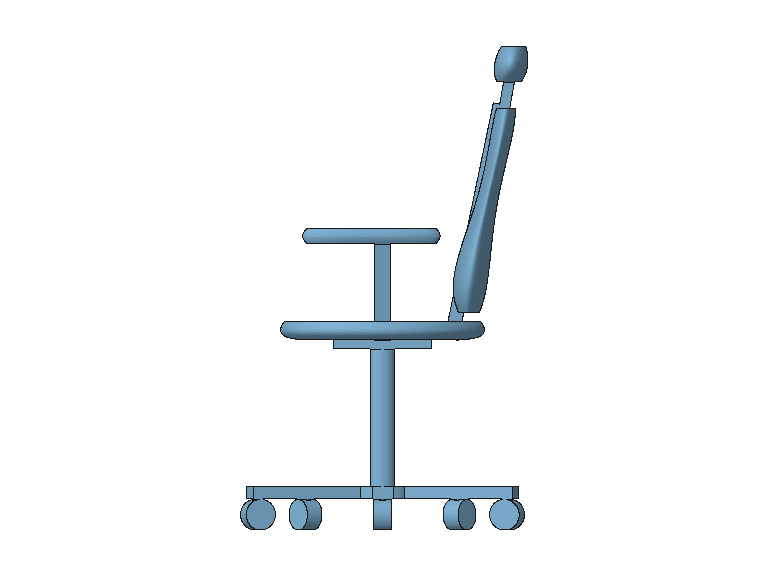

# 人体工学椅：低推理模型反馈与复验

日期：2026-10-06。子代理为 `gpt-6.1-sol`，推理强度 `low`。

子代理充当项目实际 AI，仅阅读原生桥接的模型请求、工具声明、响应与实际渲染；
没有读取项目源码、使用浏览器或直接编写几何脚本。用户请求为「创建一个人体工学椅」。
所有几何通过项目校验工具声明，交给真实 FreeCAD worker 构建。
运行目录为 `data/ergonomic_chair_feedback_trial/`，供应商配置只用于隔离服务。

## 模型与交付

自主设计包含座垫、腰部前凸且后倾的靠背、头枕、扶手、支柱与五爪脚轮。
12 个 Body、44 个特征、17 个原生草图、5 个原生放样、11 个 Fixed 关节。
实测包围盒约 609.317 × 648.695 × 1090 mm，12 个实体有效，STEP 往返检查通过。
原生 Assembly/OndselSolver 保存一个静态求解姿态；导出 FCStd 保留 Body、草图及关节。
导出文件 ZIP 完整性检查通过，复制后的字节哈希保存于交付索引。

- [可编辑 FCStd](../../data/ergonomic_chair_feedback_trial/delivery/ergonomic_chair.FCStd)
- [STEP](../../data/ergonomic_chair_feedback_trial/delivery/ergonomic_chair.step)
- [交付索引](../../data/ergonomic_chair_feedback_trial/delivery/delivery.json)
- [子代理原始反馈及复验](agent_feedback.md)

最终 v3 产物：`sha256:60ac3f8a3b4190a8d9adc90789b3edd02b666f449e092d7721929837c259f0ee`。
创建回合 7 步，修复后复验 3 步；实际终态保存于 `final_result.json`。

## 反馈驱动的修复

| 实际问题 | 修复及复验 |
| --- | --- |
| 装配工具重复内嵌 `$defs` | 定义保留于 schema 根部，参数声明由 8956 降至 5003 字符，减少约 44%。真实模型请求只有一份定义，嵌套参数与 null 清除仍通过校验。 |
| 空模型摘要误称 worker 不可达 | 区分空模型与本版无保存测量，提示先创建几何并 commit，保留未验证标记。回归测试覆盖两种情况。 |
| 无用户尺寸时警告要求填 confirmed 数值 | Gate 与提交摘要明确无数值时无需写约束，禁止编造确认值；仍如实保留待验收状态。子代理读取实际新提示并复核。 |
| 完整导出文件名产生双扩展名 | 格式匹配的后缀先归一化，再添加规范扩展名；名称安全校验仍先执行。真实 FCStd/STEP 复验输出正确，字节与源产物一致。 |
| iso 从椅背看，支撑面遮挡 | 工具说明给出相机方向，引导选择其他视角。子代理实际查看 front/right 像素确认形态；未新增相机功能。 |

## 验证与范围

- 完整单元测试：1513 通过，无跳过；只有现有 Starlette/AnyIO 弃用警告。
- 原生装配及曲面配方真实 FreeCAD 契约测试：32 通过，无跳过。
- 前端测试：77 通过，无跳过；本次未修改前端运行时代码。
- `git diff --check`：通过。

基线在受限沙箱中有 1 个 worker 失败及 2 个本机监听权限错误；允许启动本机服务与
FreeCAD 后，原始基线 1504 项单元测试全部通过。最终日志在隔离目录的
`final_unit_tests.log`、`final_contract_tests.log`，前端日志为 `baseline_frontend_tests.log`。
创建与复验完整事件分别保存在 `events.sse`、`retest_events.sse`，实际模型输入输出保存在 `spool/`。

最终 `design_review` 为 `draft / verified=false`。模型是静态可编辑概念稿，
人体参数适配、舒适性、承载、疲劳、倾覆稳定性及脚轮可靠性尚未验证；
未设计升降、后仰锁定或脚轮旋转机械机构。自主尺寸没有标为用户确认约束。
当前证据证明几何与导出可用，不证明产品人体工学性能或生产就绪。
