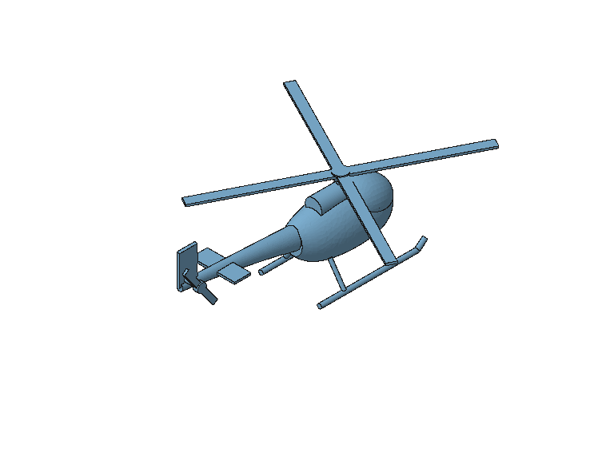

# 多 Body 直升机：模型子代理反馈验收

日期：2026-10-06。子代理使用 `gpt-6.1-sol`、`high`。

## 执行方式与交付

子代理不使用浏览器、不阅读项目源码，只读取原生模型桥接提供的实际提示、工具声明和响应，
通过项目的声明式工具自主建模。父代理依据实时反馈修改实现，子代理在安全重启后复验。
几何及机构运动使用真实 FreeCAD worker，没有调用项目配置的外部模型供应商。

最终模型为 v6、16 个独立 Body，包含光顺放样机身、渐缩尾梁、驾驶舱罩、
引擎、桅杆、四叶主旋翼、双叶尾旋翼、尾鳍、稳定翼、尾轴、两条滑橇和四根支撑。
13 个 Fixed、2 个 Revolute 原生关节和两个 Angular 驱动生成 41 个运动帧。

不可变产物：`sha256:f3a5c9930c750e14ae94d3c1f0261da264a2d111e26e5f0d9139d31d1adbaa8b`。
四份最终交付均绑定该产物，文件来源及 SHA-256 记录在
[交付索引](../../data/helicopter_feedback_trial/delivery/delivery.json)。

- [可编辑原生装配 FCStd](../../data/helicopter_feedback_trial/delivery/helicopter.FCStd)
- [STEP](../../data/helicopter_feedback_trial/delivery/helicopter.step)
- [分散到合拢的装配 GIF](../../data/helicopter_feedback_trial/delivery/assembly.gif)
- [原生双旋翼运动 GIF](../../data/helicopter_feedback_trial/delivery/rotors.gif)

## 反馈与改进

| 子代理实际遇到的问题 | 修改与复验 |
| --- | --- |
| 四项 scoped help 重复大量嵌套 schema，终端输出截断 | 帮助只返回操作、规则与示例；完整 schema 保留在工具声明和校验。四项回复合计减少约 66%。 |
| 初始工具表没有 assembly_configure，解锁条件不明确 | ir_help 明确 topic=assembly 的解锁方式，给出可校验的关节/驱动示例。 |
| 批量椭圆截面报错没有指出草图 | 错误包含 ops 索引及新增实体 ID，失败补丁保持原模型不变。 |
| 没有拆件到合件展示 | assembly_export 新增 assemble/explode 模式，保持 grounded 部件固定，保留最终姿态；按反馈缩短自动分散距离以改善可读性。 |
| 本地兼容服务只收到渲染收据 | YAML、设置 API、设置界面增加模型视觉能力覆盖，HotSwap descriptor 使用同一解析结果；真实子代理输入实际含 2 个 image_url，已查看。 |
| 曲面出现黑色斑点 | 识别为 BRep 曲面内部细长三角片被误画成折边；使用不可变场景的原生面映射抑制伪边线，保留实际面边界与轮廓。子代理实际看图确认消除。 |
| fcstd 导出没有保留原生关节 | 优先导出保存的 assembly.FCStd，包含源 Body、原生 Assembly/Joint/Simulation 对象及两份 Motion 驱动。 |
| 最终复核缺少实际 check_id | 成功 commit 返回每项检查的 ID、状态、置信度、消息与测量，子代理据此复核，未伪造检查编号。 |
| 新 modify 回合直接 geo_view 被 checkpoint 拦截 | 说明本回合须成功 commit；inspect 可直接渲染已有产物。原有 checkpoint 控制保持有效。 |
| 提交前审查发现非整除 stride 的末帧计时偏长 | GIF 使用实际采样间隔，视频保留源帧时间戳；实际解码 GIF、MP4、AVI、WebM 验证末帧按原时间到达。 |

子代理还发现尾旋翼与稳定翼在两个采样姿态干涉；它通过项目工具前移稳定翼并重新提交。
最终选定 7 对零件在全部 41 帧的 BRep 交叠检查中为 0 个干涉项。实测实体有效，
包围盒为 395 × 310 × 120 mm。GIF 均可解码；装配 GIF 首帧分散、末帧合拢，
旋翼 GIF 两旋翼改变姿态。最终装配演示使用 110 mm 分散距离、41 帧。

## 验证与范围

- `pytest tests/unit -q`：提交前复查 1446 通过，无跳过。
- 原生装配、不可变场景及紧凑建模真实 FreeCAD 契约测试：23 通过，无跳过。
- `node --test tests/frontend/*.test.mjs`：提交前复查 77 通过，无跳过；包含图像设置三态保存与供应商切换。
- `git diff --check`：通过。
- 最终工具描述补充后相关工具/Schema/注册表测试：37 通过。

提交前已审查全部实现与测试改动，修复上述末帧时序问题，未发现其余阻塞问题。
Python 验证仅产生现有 Starlette/AnyIO 依赖弃用警告。复查日志为隔离目录中的
`review_unit_tests.log`、`review_contract_tests.log`、`review_frontend_tests.log`。

构建 Gate 通过，未把自主设计尺寸标为用户确认约束。最终 `design_review` 实际返回
`draft / verified=false`：当前验收契约仅认可已确认约束的测量证据，不能充分记录视觉、
原生关节及已保存文件的工具证据，因此追加了 9 项缺少需求测量证据的提示。
该表达层限制已记录为后续改进项；上述 CAD、动画及采样证据均已保存，定性设计仍待用户审阅。
装配合拢路径是展示路径，不是插装路径或关节求解；旋翼运动来自原生求解。
采样检查只覆盖声明的 7 对零件与 41 个姿态，不证明连续间隙、装配路径碰撞或飞行能力。
单色显示与驾驶舱材质区分的建议已记录，尚未增加材质/分件配色功能。

## 本地复查资料

隔离数据目录为 `data/helicopter_feedback_trial/`，未改主服务保存的供应商设置。
`events.sse`、`continue_events.sse`、`final_events.sse` 保存原始工具事件；
`spool/` 保存实际模型输入/响应，`unit_tests_verified.log`、`contract_tests.log` 和
`frontend_tests.log` 保存验证日志。独立测试服务和模型桥接在验收后关闭。
